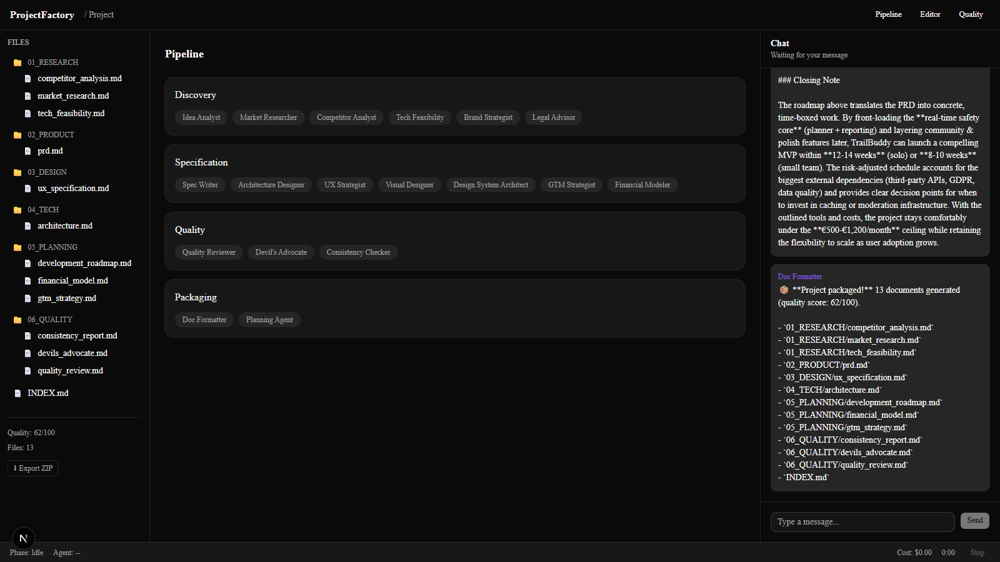

<div align="center">

# 🏭 ProjectFactory

**A multi-agent AI factory that turns a one-line idea into a complete,
quality-scored project specification — with a human in the loop at every gate.**

[](frontend)
[](backend)
[](backend/app/agents)
[](backend/app/agents/research.py)
[](LOCAL_MIGRATION_PLAN.md)
[](https://github.com/OytunOnal/IdeaAndProjectDevelopmentFactory/actions)



</div>

## What it does

You describe an idea in one message. A pipeline of LangGraph agents interviews
you, researches the market with live web data, writes the full specification
set, stress-tests it, and hands you a ZIP:

```
💡 idea ──▶ 🗣️ Idea Analyst          conversational brief (one question at a time)
                 │  ✅ you approve
            🔍 Research               market · competitors · tech feasibility
                 │  ✅ you approve       (web-grounded via Claude web_search)
            📝 Specification          PRD · architecture · UX · GTM · financials
                 │  ✅ you approve
            🥊 Quality gate           rubric score /100 · devil's advocate · consistency
                 │  ✅ you approve
            📦 Packaging              implementation roadmap + 13-document ZIP
```

Every document — not just every phase — stops at a **decision card**: approve
as-is, apply the document's own recommended adjustments (and either continue or
review the result), or just tell the chat what to change in plain language.
The chat understands intent — "rewrite this", "go back to the devil's advocate
step", "apply 1 and 3 and continue" — with deterministic shortcuts for the
unambiguous cases so a weak model can never misread "rewrite" as approval.
While agents work, progress streams to the UI over WebSocket, documents appear
in the file tree as they are written (chat stays a thin control channel), and
everything survives a server restart.

## The agents

| Phase | Agent | Output |
|---|---|---|
| Discovery | `idea_analyst` | Structured brief via guided conversation |
| Discovery | `market_researcher` | TAM/SAM/SOM, trends — **live web data, cited** |
| Discovery | `competitor_analyst` | Landscape, gaps, positioning — **live web data** |
| Discovery | `tech_feasibility` | Stack alternatives, risks, recommendation |
| Specification | `spec_writer` | PRD with MoSCoW features + user stories |
| Specification | `architecture_designer` | System design, API, DB schema (mermaid) |
| Specification | `ux_strategist` | User flows, screen specs, design system |
| Specification | `gtm_strategist` | Launch plan, channels, first-1000-users plan |
| Specification | `financial_modeler` | Pricing, projections, unit economics |
| Quality | `devils_advocate` | Adversarial critique with one-click-applicable mitigations |
| Quality | `consistency_checker` | Cross-document contradiction report, fixes applicable to specs |
| Quality | `quality_reviewer` | Runs **last**, with the adversarial findings in view: 100-point rubric score, rubric-versioned, every deduction backed by a quoted span |
| Packaging | `planning_agent` | Phased roadmap + sprint plan |
| Packaging | `doc_formatter` | Final 13-file document set (deterministic, no LLM) |

Plus an `orchestrator` (state-machine router), a `decision_handler` (HITL
gates with per-category autonomy levels), and discussion agents that answer
questions about the documents before you approve each phase.
`brand_strategist`, `legal_advisor`, `visual_designer` and
`design_system_architect` are speced ([docs/03](docs/03_AGENT_SPECIFICATIONS.md))
and stubbed — roadmap.

## Evaluated first, migrated second: the local-model story

Every agent role is being migrated to **local models (Ollama)** — but only
after it clears a measuring harness. The evals came first, the migration
decisions fell out of the numbers:

| Config | Intent role (68-case golden set) | Generator roles (10 spec docs, fixed-context, judged) | Adversarial review, as ONE monolithic call (15 seeded defects) |
|---|---|---|---|
| Frontier API (fallback chain) | 87% | strongest breadth (14-story PRDs) | 77% → **100%** after a measured prompt upgrade* |
| **qwen3:8b, thinking on — runs the chat layer** | **90±1%** (7 rounds: 82→79→87→84→91→85→90) | unfit: arithmetic incoherence in the financial model, fabricated a cited stat | 27%, with fabricated citations — hopeless as a single call |
| **qwen3.6:35b, thinking on — runs the 5 spec generators** | 81% | **at/near frontier parity**; best-in-eval financial model (only fully consistent numeric chain) | ~50%, unstable empty output |
| deepseek-r1:7b | 51% | unfit: generic, ungrounded output | 3% — "reasoning model ⇒ good reviewer" falsified |
| **Decomposed 6-pass review (8B + 35B) — runs the adversarial review today** | — | — | **11-12/15 on a sealed held-out set** — frontier-baseline recall, fully local runtime (story below) |

<sub>*development-set numbers — the prompts were tuned against these fixtures;
a held-out set decides any general claim. The caveat is stamped in the reports.</sub>

Two lessons the generator eval taught: **verdicts are per-role, not per-model**
(the intent winner, 8B, fails financial arithmetic; the intent runner-up, 35B,
writes the best financial model) — and **infrastructure can masquerade as model
weakness** (35B's one bad document was a token-cap truncation, cured by raising
the generation budget, not by changing models).

What made the local chat layer reach (and pass) frontier parity is a
**semantic verification stack**, not keyword rules: before a state-changing
action applies, the model answers one narrow question about it — "is this an
explicit go-ahead?" (3 diverse samples, majority vote, fail-open), "is this an
instruction or a question to answer first?", "which document does this change
belong to?". It exploits the measured asymmetry that small models are weak at
broad action parsing but near-frontier on narrow questions — and local
inference makes the extra calls free.

### The adversarial review went local by decomposition, not by model swap

The "criticize everything" Devil's Advocate was the table's worst cell — no
local model survived it as a single call. The migrated version
(`DA_DECOMPOSED=true`) splits it into **six micro-passes ordered by
verifiability**, each with the same skeleton: a narrow LLM extraction, code
that validates every claim (verbatim-quote grounding, AST-evaluated
arithmetic, unit-family pairing, derivation guards), majority-voted narrow
verification, and a deterministic report where every finding carries its
evidence. Five passes run on the 8B model; only the open-critique judge
needs the 35B — the measured boundary is narrow-factual questions (8B
reliable) vs evaluative judgment (8B undiscriminating in every prompt
framing tried). On a **sealed held-out set** — two unseen domains, 15 fresh
seeded defects, one run, no iteration — the decomposed system caught 11-12
of 15 with no drop from its development band: the recall of the frontier
monolithic baseline, on a fully local runtime. The false-positive gaps the
held-out run exposed are locked as deterministic unit tests, and the
monolithic path remains the automatic fallback.

The full trail: [`EVAL_PLAN.md`](EVAL_PLAN.md) (design for all 29 nodes) ·
[`backend/evals/REPORT.md`](backend/evals/REPORT.md) (role × model matrix and
round history) · [`backend/evals/JUDGE_SCORES.md`](backend/evals/JUDGE_SCORES.md)
(per-defect judging) · [`LOCAL_MIGRATION_PLAN.md`](LOCAL_MIGRATION_PLAN.md)
(principles, phases, and the keyword-vs-semantic architecture decision).

## AI engineering under the hood

This project demonstrates, in working code:

- **Agent orchestration with LangGraph** — a 25-node `StateGraph` with an
  orchestrator-router, conditional edges, and per-project checkpointing
  ([graph.py](backend/app/agents/graph.py), [orchestrator.py](backend/app/agents/orchestrator.py))
- **Human-in-the-loop design** — per-document approval gates with revision
  loops, "apply & continue" vs "apply & review" semantics, reopenable steps —
  including **cross-phase rewind** (jump back to an earlier phase; documents
  and approvals are preserved, phase gates re-confirm on the way forward) and
  post-completion editing; configurable autonomy (`ask` / `suggest` /
  `delegate` per decision category)
  ([decision_handler.py](backend/app/agents/decision_handler.py))
- **Intent routing with layered guardrails** — free-text chat maps to typed
  actions (revise / approve / reopen / improve); unambiguous requests
  ("rewrite this", "go back to X") bypass LLM parsing deterministically, and
  state-changing actions pass **narrow semantic verification** (majority-voted
  go-ahead check, instruction-vs-question gate, glossary-assisted target
  routing) before they touch state ([common.py](backend/app/agents/common.py))
- **Per-role model routing** — each role can run on a different provider, and
  a role can pin a specific local model
  (`LLM_ROLE_PROVIDERS=discussion=ollama,spec=ollama:quality` — because eval
  verdicts are per-model, not per-tier), with per-role thinking control,
  force/fallback precedence, and Ollama-specific reliability engineering
  (native-API thinking control, context-window and empty-output handling —
  each one a measured failure mode) ([llm.py](backend/app/agents/llm.py))
- **Evaluation harnesses as first-class code** — a 68-case golden-intent set
  driven through the real code path, a seeded-defect eval (15 planted
  flaws across two fictional projects, recall + false-positive scored under a
  written judging protocol), and a fixed-context generator eval (every model
  writes each spec document from the same golden inputs, so per-role quality
  is isolated from chained error compounding; outputs judged for grounding,
  depth, and arithmetic coherence) ([backend/evals/](backend/evals/))
- **Auditable LLM-as-judge** — the quality score is rubric-versioned (stamped
  in code, so a rubric edit can't silently re-rate old packages) and every
  deduction must cite the rubric line plus a quoted span from the document
  ([quality.py](backend/app/agents/quality.py))
- **Self-consuming recommendation lifecycle** — documents end with numbered
  adjustment proposals; applying them consumes the section (no infinite
  improvement loops), earlier proposals are blocklisted downstream (no
  parroting), and fabricated evidence is banned by prompt contract
- **Regression guards on rewrites** — an "improvement" that loses >40% of a
  document is rejected rather than applied; per-project asyncio locks make
  pipeline runs atomic against double-submitted decisions
- **Tool use / grounding** — research agents call Claude's server-side
  `web_search` tool and return cited, current data
  ([research.py](backend/app/agents/research.py))
- **Multi-provider LLM layer with automatic fallback** — Google → Cerebras →
  Groq → DeepSeek → Anthropic, 429 retry with backoff, BYOK support, provider
  inferred from key prefix ([llm.py](backend/app/agents/llm.py))
- **Graceful degradation** — no Anthropic key? Research falls back to
  knowledge-only reports, clearly flagged `web_grounded: false`. The whole
  pipeline runs on free-tier providers.
- **Structured outputs** — the brief and the quality verdict are extracted as
  fenced JSON and validated before use
- **LLM-as-judge with a rubric** — an independent reviewer scores the specs
  /100 and returns a machine-readable PASS/FAIL verdict
- **Durable state** — LangGraph `AsyncSqliteSaver`: kill the server mid-project,
  restart, continue where you left off
- **Real-time progress** — agents emit transient WebSocket updates while they
  work; the REST response remains the source of truth
- **Deterministic where possible** — document assembly and the ZIP export are
  plain code, not LLM calls

## Quick start

Prerequisites: Python 3.13+ with [uv](https://docs.astral.sh/uv/), Node 20+.

```bash
git clone https://github.com/OytunOnal/IdeaAndProjectDevelopmentFactory.git
cd IdeaAndProjectDevelopmentFactory
make install                     # uv sync + npm install

# Backend config — one free LLM key is enough (Google AI Studio / Groq / Cerebras)
cp backend/.env.example backend/.env      # add at least one key

# Frontend config
cp frontend/.env.example frontend/.env.local

make dev-backend                 # FastAPI on :8000
make dev-frontend                # Next.js on :3000  (separate terminal)
```

Open `http://localhost:3000` — with no Supabase configured the app runs in
**demo mode** (no login) — describe an idea, and approve your way through the
pipeline. Export the ZIP from the file tree when it completes.

### Cost profile

| Mode | Research quality | Cost per full run |
|---|---|---|
| Free providers only | Knowledge-based estimates, flagged as such | **$0** |
| + `ANTHROPIC_API_KEY` | Live web search, cited sources | ~$0.20 (Haiku) |
| + Ollama (optional) | Chat/intent layer **and the 5 spec generators** run **on your machine** — rate-limit-free, private | $0 |

Everything except research runs on free-tier providers either way. With
[Ollama](https://ollama.com) installed, the `.env.example` routing lines move
work to local inference with the frontier chain as automatic fallback:
`qwen3:8b` runs the conversation layer (measured at 90% vs the frontier
chain's 87% on the intent set), and `qwen3.6:35b` runs the five spec
generators (judged at/near frontier parity — expect ~3–4 min per document on
consumer hardware vs seconds via API).

## Repository layout

```
├── backend/                FastAPI + LangGraph
│   ├── app/agents/         the pipeline: graph, orchestrator, 14 agents
│   │   ├── llm.py          multi-provider layer (fallback, BYOK, per-role
│   │   │                   routing, Ollama native path with thinking control)
│   │   ├── research.py     web-grounded discovery agents
│   │   ├── specification.py · quality.py · packaging.py
│   │   └── graph.py        StateGraph wiring + SQLite checkpointing
│   ├── app/routers/        REST API (projects, pipeline, files, export)
│   ├── app/websocket/      live progress channel
│   ├── evals/              golden-intent + seeded-defect + generator harnesses,
│   │                       fixtures, judging protocol, REPORT.md / JUDGE_SCORES.md
│   └── tests/              pipeline flow + guard tests (mocked LLMs) — no keys needed
├── frontend/               Next.js 16 + TypeScript + Tailwind + Shadcn/UI
│   └── src/                workspace: chat + decision cards, file tree, viewer
├── docs/                   product docs: PRD, architecture, 19 agent specs,
│                           API contract, UI/UX spec, roadmap
├── EVAL_PLAN.md            evaluation design for all 29 graph nodes
├── LOCAL_MIGRATION_PLAN.md eval-gated local-model migration: principles + phases
└── Makefile                dev/install/lint/test shortcuts
```

## Testing

```bash
make test-backend    # 47 tests: full pipeline flow with mocked LLMs, gates,
                     # revisions, intent shortcuts, negation guard, persistence
make lint-backend    # ruff
cd frontend && npm run lint && npx tsc --noEmit
```

The pipeline tests drive idea → research → spec → quality → packaging through
the real LangGraph graph with mocked LLM calls — routing, gates, and state
transitions are verified without spending a token. The LLM-dependent evals
(`python -m evals.eval_runner`, `python -m evals.defect_runner`) run locally
against Ollama or the frontier chain and write scored JSON reports.

## Honest limitations / roadmap

- Four agents are speced but stubbed (brand, legal, visual design, design system).
- The eval numbers above are **development-set results** — verifier policies
  were iterated against those fixtures. A held-out fixture set (planned) decides
  any general claim; known remaining classes ("the spec"→PRD mapping,
  conditional branch-guessing, multi-document edits in one message) are parked
  for distillation or feature work rather than more prompt surgery.
- The discussion/intent role, the five spec generators, and (opt-in,
  decomposed) the adversarial review run local; the consistency-checker and
  LLM-judge roles stay on the frontier chain pending their own evals
  ([REPORT.md](backend/evals/REPORT.md) has the numbers and why).
- Free-tier rate limits are real: context windows sent to quality agents are
  truncated to fit Groq's 6k TPM; a paid key removes the constraint.
- Auth (Supabase magic-link) is optional and off by default; the SQL schema for
  a hosted Postgres deployment ships in `backend/migrations/`.
- Streaming responses are implemented in the LLM layer but the UI currently
  updates per-message, not per-token.

## License

All rights reserved — source available for portfolio review.
